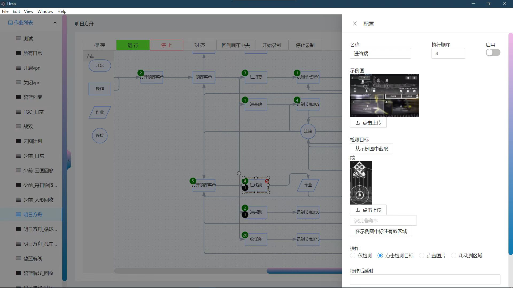

# ursa

ursa是一个可视化编排的自动化脚本程序，基于图片识别或指定位置，对一系列的鼠标点击操作进行自动化

## 使用到的框架和包

### 后端部分:

https://github.com/yx179971/ursa-backend
- fastapi+redis+sqlite3+celery+pyautogui+cv2+pynput

### 前端部分:

https://github.com/yx179971/ursa-frontend
- vue+antd+antv/x6+electron

## 功能介绍

如下图所示分为左侧的作业列表和右边的工作区，以及单击节点时会弹出一个配置区域

- 作业列表可拖拽排序
- 可在当前工作区进行录制操作，录制完成后生成的节点会放到当前画布上
- 节点类别：
    - 开始节点：作业中只能有最多一个开始节点作为工作流的起点，如果没有该节点则选择无上游的唯一节点作为起点
    - 操作节点：鼠标操作节点，可配置要点击的图片，或者点击基于视窗截图的区域
    - 作业节点：嵌套执行另外一个作业
    - 连接节点：用于节点连线
- 所有节点都可配置执行次数、执行优先级，检测目标是触发节点的条件，配合使用可以实现条件和循环跳出操作

## 后续规划
- [x] 部署
- [ ] 一键启动
- [x] 暂停
- [x] 热重载
- [ ] 配置窗口指定等
- [ ] 节点配置界面优化
- [ ] 状态日志实时推送
- [ ] 作业导入导出
- [ ] 多平台支持
- [ ] 整屏监控模式